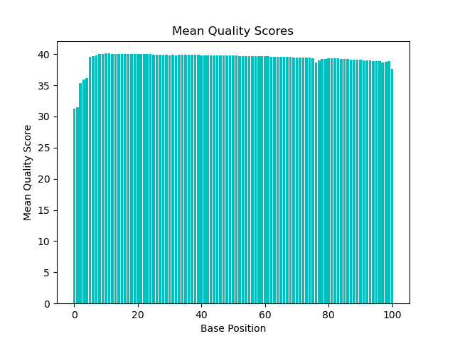
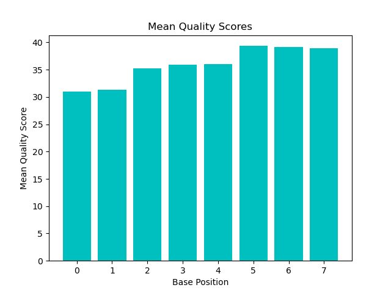
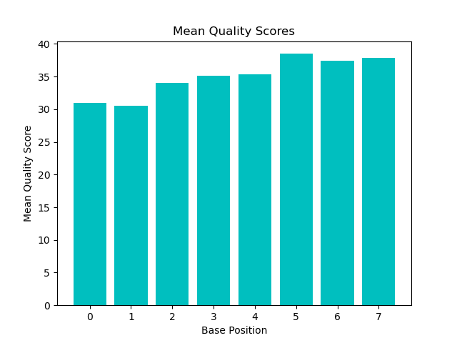
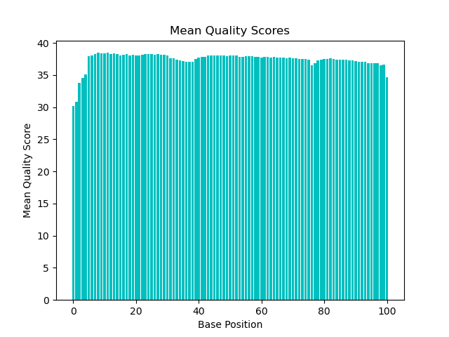

# Assignment the First

## Part 1
1. Be sure to upload your Python script. Provide a link to it here: [../mean_qscore.py](../mean_qscore.py)

| File name | label | Read length | Phred encoding |
|---|---|---|---|
| 1294_S1_L008_R1_001.fastq.gz |read1|101|phred33+|
| 1294_S1_L008_R2_001.fastq.gz |index1|101|phred33+|
| 1294_S1_L008_R3_001.fastq.gz |read2|101|phred33+|
| 1294_S1_L008_R4_001.fastq.gz |index2|101|phred33+|

```
commands used:
zcat /projects/bgmp/shared/2017_sequencing/1294_S1_L008_R2_001.fastq.gz | head -10
zcat /projects/bgmp/shared/2017_sequencing/1294_S1_L008_R4_001.fastq.gz | head -2 | wc -L
zcat /projects/bgmp/shared/2017_sequencing/1294_S1_L008_R4_001.fastq.gz | sed -n '4~4p' | head -1
```
2. Per-base NT distribution
    1. 
    2. 
    3. 
    4. 
    s
3. Qscore cutoff:
```
I would choose the cutoff of 30 because that means there every 1 in 1000 base pairs will be incorrect. 
I think having enough coverage could overcome this error rate depsite the fact 1 error in every 1000
is actually a large number of errors given the amount of base pairs that are read.
```
4. Ns in indexes: R2-3976613   R3-3328051
```
zcat /projects/bgmp/shared/2017_sequencing/1294_S1_L008_R2_001.fastq.gz | sed -n '2~4p' | 
grep 'N' | wc -l
zcat /projects/bgmp/shared/2017_sequencing/1294_S1_L008_R3_001.fastq.gz | sed -n '2~4p' | 
grep 'N' | wc -l

```


## Part 2
1. Define the problem
```
The purpose of this file is to daigram out how to de-multiplex 4 fastq files.
given four input FASTQ files (2 with biological reads, 2 with index reads) and the 24 known indexes above, demultiplex reads by index-pair...
```

2. Describe output
```
...one R1 FASTQ file and one R2 FASTQ file per matching index-pair,
another two FASTQ files for non-matching index-pairs (index-hopping), and
two additional FASTQ files when one or both index reads are unknown or low quality (do not match the 24 known indexes [this includes indexes with 'N's in them] or do not meet a quality score cutoff)
algorithm should report:
the number of read-pairs with properly matched indexes (per index-pair),
the number of read pairs with index-hopping observed, and
the number of read-pairs with unknown index(es).
```
3. Upload your [4 input FASTQ files](../TEST-input_FASTQ) and your [>=6 expected output FASTQ files](../TEST-output_FASTQ).
4. Pseudocode
5. High level functions. For each function, be sure to include:
    1. Description/doc string
    2. Function headers (name and parameters)
    3. Test examples for individual functions
    4. Return statement
